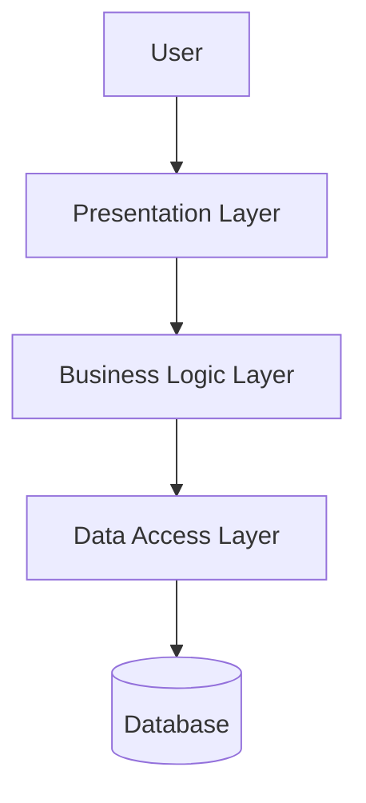

# System Architecture

## 1. Overview

This document describes the overall architecture of the system,
including its major components, modules, and interactions.

## 2. Architecture Pattern

The system follows a 3-Tier Architecture.

The three layers are:

1. Presentation Layer
2. Business Logic Layer
3. Data Access Layer

## 3. Presentation Layer

This layer handles the user interface and user interactions.

## 4. Business Logic Layer

This layer handles the main application logic,
validation, and processing.

## 5. Data Access Layer

This layer handles communication with the database.

## 6. Major Modules

- Authentication Module
- User Management Module
- Main Application Module
- Admin Module

## 7. System Flow

User → Presentation Layer → Business Logic Layer
→ Data Access Layer → Database

## 8. Architecture Diagram

