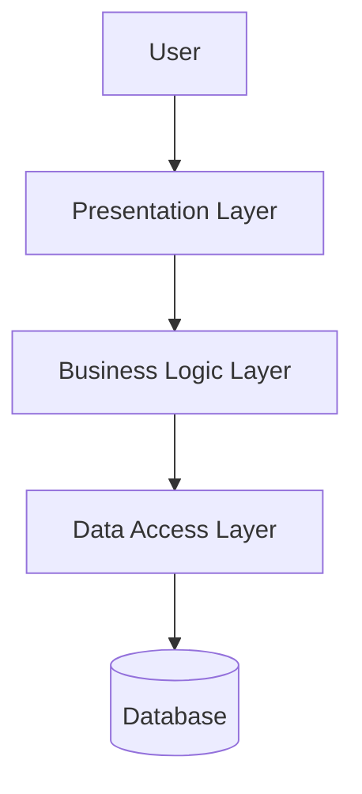

# System Architecture

## 1. Overview

This document describes the overall architecture of the system,
including its major components, modules, and interactions.The system enables buyers, investors, banks, and real estate professionals to evaluate properties by collecting property information, performing risk assessments, and generating due diligence reports.

## 2. Architecture Pattern

The system follows a 3-Tier Architecture.

The three layers are:

1. Presentation Layer
2. Business Logic Layer
3. Data Access Layer

This architecture promotes separation of concerns, maintainability, and scalability.

## 3. Presentation Layer

This layer handles the user interface and user interactions.
# Components
Login Page
Registration Page
Dashboard
Property Search Page
Property Details Page
Report Viewing Page

# Technologies
ReactJS
Next.js
Tailwind CSS
 
## 4. Business Logic Layer

This layer handles the main application logic,
validation, and processing.

# Modules

Authentication Module
User Login
User Registration
JWT Authentication
Role-Based Access Control

# Property Search Module
Property Search
Address Validation
Property History Retrieval

# Due Diligence Module
Ownership Verification
Property Tax Analysis
Permit Record Analysis
Flood Zone Verification
Zoning Information Retrieval

# Risk Assessment Module
Legal Risk Analysis
Tax Due Analysis
Flood Risk Evaluation
Permit Compliance Verification

# Report Generation Module
Risk Score Calculation
PDF Report Generation
Excel Report Generation

# Notification Module
Report Ready Notifications
Property Update Alerts
Email Notifications

# Audit Module
User Activity Logging
API Monitoring
Report History Tracking
## 5. Data Access Layer

This layer handles communication with the database.

## 6. Major Modules

- Authentication Module
- User Management Module
- Main Application Module
- Admin Module

## 7. System Flow

User → Presentation Layer → Business Logic Layer
→ Data Access Layer → Database

## 8. Architecture Diagram

