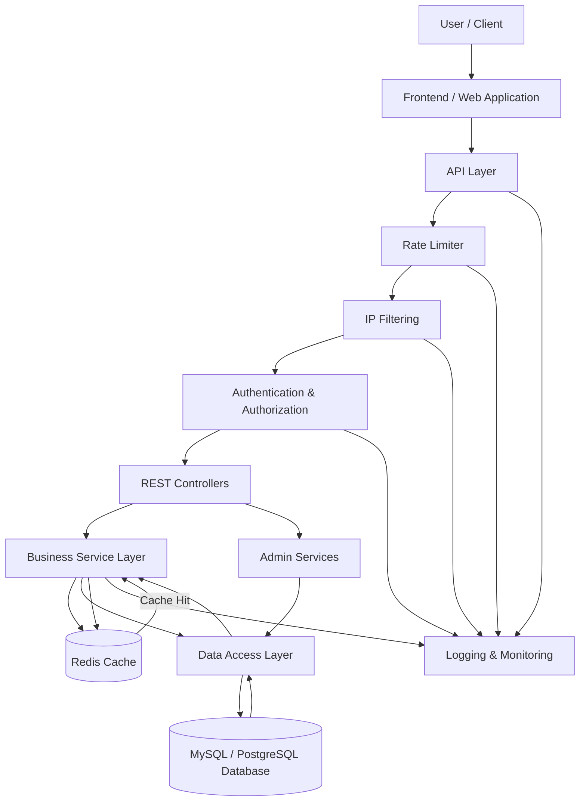

# System Architecture

## 1. Overview

This document describes the overall architecture of the system, including its major components, modules, security mechanisms, data flow, caching strategy, and interactions between different layers.

The system is designed as a scalable and secure backend application using a layered architecture with Redis caching, API request protection, authentication, authorization, and persistent database storage.

---

## 2. Architecture Pattern

The system follows a **Layered Architecture** combined with centralized security and infrastructure components.

The major layers and components are:

1. Client / Presentation Layer
2. API Layer
3. Security Layer
4. Business Logic Layer
5. Caching Layer
6. Data Access Layer
7. Database Layer
8. Logging and Monitoring

The traditional three-tier structure is maintained internally:

* Presentation / API Layer
* Business Logic Layer
* Data Access Layer

Additional infrastructure components such as Redis, rate limiting, IP filtering, authentication, and logging are integrated around these layers.

---

## 3. Client / Presentation Layer

This layer provides the user interface through which users interact with the system.

Responsibilities include:

* User registration and login
* Sending API requests
* Displaying application data
* Handling user interactions
* Displaying success and error responses
* Communicating with backend REST APIs

The frontend does not directly communicate with the database.

All application data is accessed through backend APIs.

---

## 4. API Layer

The API layer acts as the entry point for client requests.

It exposes REST APIs and forwards valid requests to the appropriate business services.

Responsibilities include:

* REST API endpoints
* Request handling
* Request validation
* Response generation
* API routing
* Error handling

The API layer communicates with the Business Service Layer instead of directly accessing the database.

---

## 5. Security Layer

The security layer protects the application from unauthorized and excessive requests.

It consists of:

* Authentication
* Authorization
* Rate Limiting
* IP Filtering

### 5.1 Authentication

Authentication verifies the identity of a user before allowing access to protected resources.

The system can use Spring Security with JWT-based authentication.

Authentication is responsible for:

* User login
* Credential verification
* Token generation
* Token validation
* Protecting secured endpoints

### 5.2 Authorization

Authorization determines whether an authenticated user has permission to access a particular resource.

Role-based access control can be used for different users.

Example:

* USER
* ADMIN

Administrative APIs are accessible only to authorized administrators.

### 5.3 Rate Limiting

Rate limiting controls the number of requests that a client can make within a specified period.

Redis can be used to maintain request counters efficiently.

Example flow:

Client → Rate Limiter → Request Allowed / Request Rejected

When the request limit is exceeded, the system returns:

```text
HTTP 429 - Too Many Requests
```

Rate limiting helps protect the system from excessive traffic and API abuse.

### 5.4 IP Filtering

IP filtering allows the system to control access based on client IP addresses.

The system can maintain allowed or blocked IP addresses.

Example:

```text
Incoming Request
       |
       v
   IP Filter
       |
   +---+---+
   |       |
Allowed  Blocked
   |       |
   v       v
Continue  Reject
```

Blocked requests are rejected before reaching the main business logic.

---

## 6. Business Logic Layer

The Business Logic Layer contains the core application functionality.

Responsibilities include:

* Processing business rules
* Validating application data
* Executing application workflows
* Calling Redis when cached data is required
* Calling the Data Access Layer when database access is required
* Processing service-level operations
* Handling application exceptions

The business layer is independent of the user interface and database implementation.

---

## 7. Redis Caching Layer

Redis is used as an in-memory caching system to improve application performance and reduce unnecessary database queries.

Redis can be used for:

* Frequently accessed application data
* Temporary data
* Session-related information
* Rate-limit counters
* Cached user/application information

### 7.1 Cache-Aside Strategy

The application follows a Cache-Aside approach.

The flow is:

```text
Request
   |
   v
Business Service
   |
   v
Check Redis
   |
   +---- Cache Hit ----> Return Cached Data
   |
   +---- Cache Miss
             |
             v
          Database
             |
             v
        Store in Redis
             |
             v
        Return Data
```

This reduces database load and improves response time for frequently requested data.

---

## 8. Data Access Layer

The Data Access Layer provides communication between the Business Logic Layer and the database.

Responsibilities include:

* CRUD operations
* Database queries
* Repository management
* Entity persistence
* Transaction management
* Database connection handling

In a Spring Boot implementation, Spring Data JPA and Hibernate can be used for database access.

---

## 9. Database Layer

The database provides persistent storage for the application's important data.

Possible data stored in the database includes:

* User information
* Roles and permissions
* Application data
* Configuration information
* Audit information

A relational database such as MySQL or PostgreSQL can be used.

The database acts as the persistent source of truth, while Redis is primarily used for fast cached access.

---

## 10. Admin Module

The Admin Module provides privileged functionality for authorized administrators.

Responsibilities can include:

* User management
* Role management
* IP whitelist/blacklist management
* Monitoring system activity
* Managing application configuration
* Viewing audit information

All administrative operations are protected using authentication and role-based authorization.

---

## 11. Logging and Monitoring

The system maintains logs for important application and security events.

Examples include:

* Login attempts
* Authentication failures
* API requests
* Rate-limit violations
* Blocked IP requests
* Database errors
* Application exceptions
* Administrative activities

Logging helps with:

* Debugging
* Security auditing
* Error investigation
* Application monitoring

---

## 12. Major Modules

The major modules of the system are:

* Authentication Module
* Authorization Module
* User Management Module
* Main Application Module
* Admin Module
* Redis Cache Module
* Rate Limiting Module
* IP Filtering Module
* Data Access Module
* Logging and Monitoring Module

---

## 13. System Request Flow

A normal request follows this flow:

```text
User
  |
  v
Frontend / Client
  |
  v
API Layer
  |
  v
Rate Limiter
  |
  v
IP Filter
  |
  v
Authentication / Authorization
  |
  v
REST Controller
  |
  v
Business Service
  |
  v
Redis Cache
  |
  +---- Cache Hit ----> Response
  |
  +---- Cache Miss
            |
            v
      Data Access Layer
            |
            v
         Database
            |
            v
      Store in Redis
            |
            v
         Response
            |
            v
         Frontend
            |
            v
           User
```

---

## 14. Error Handling

The system uses centralized exception handling to provide consistent error responses.

Common HTTP responses include:

```text
400 - Bad Request
401 - Unauthorized
403 - Forbidden
404 - Resource Not Found
429 - Too Many Requests
500 - Internal Server Error
```

A global exception handler processes application errors and returns appropriate responses to the client.

---

## 15. High-Level Architecture Diagram



---

## 16. Technology Stack

| Component       | Technology                       |
| --------------- | -------------------------------- |
| Frontend        | HTML / CSS / JavaScript or React |
| Backend         | Spring Boot                      |
| API             | REST API                         |
| Security        | Spring Security                  |
| Authentication  | JWT                              |
| Caching         | Redis                            |
| Rate Limiting   | Redis                            |
| Database        | MySQL / PostgreSQL               |
| ORM             | Spring Data JPA / Hibernate      |
| Build Tool      | Maven                            |
| API Testing     | Postman                          |
| Version Control | Git / GitHub                     |
| Monitoring      | Application Logging              |

---

## 17. Architecture Summary

The system uses a layered and modular architecture where each component has a specific responsibility.

The client communicates with the API layer, while security components protect incoming requests. The Business Logic Layer processes application operations and communicates with Redis for cached data and the Data Access Layer for persistent database operations.

Redis improves performance by reducing repeated database queries and also supports rate-limiting operations. Authentication, authorization, and IP filtering improve application security, while centralized logging and monitoring assist with debugging and system administration.

This architecture provides a foundation for building a secure, scalable, maintainable, and high-performance backend application.
